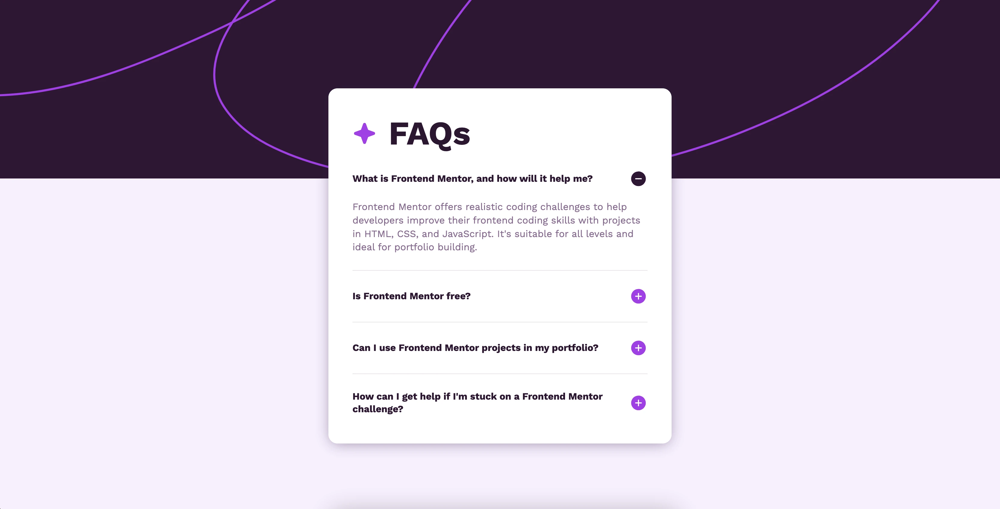
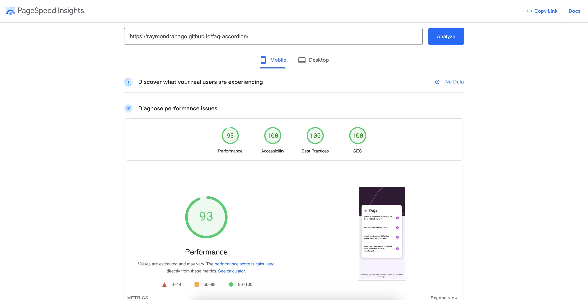
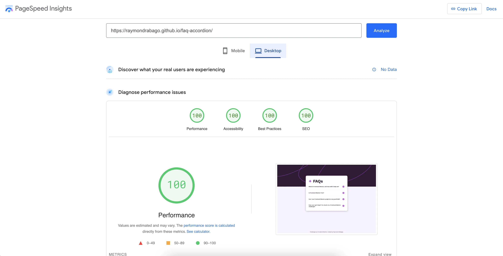

# Frontend Mentor - FAQ accordion

This is my way of coding for [FAQ accordion challenge on Frontend Mentor](https://www.frontendmentor.io/challenges/faq-accordion-wyfFdeBwBz). 



## Table of contents

- [Overview](#overview)
  - [The challenge](#the-challenge)
  - [Screenshot](#screenshot)
  - [Links](#links)
- [My process](#my-process)
  - [Built with](#built-with)
  - [What I learned](#what-i-learned)
- [Author](#author)

## Overview

Hello! In this project, I'm showcasing my front-end skills in DOM manipulation, creating a mobile-responsive UI, enhancing accessibility, and optimizing page performance, all while building on my experience with Frontend Mentor challenges.

### The challenge

Users should be able to:

- View the optimal layout depending on their device's screen size
- Toggle the visibility of the answer when the question is clicked.
- Navigate through the questions and toggle answer visibility using keyboard navigation only.
- View hover and focus states for all interactive elements on the page.

### Screenshot
After solving the UI challenge, I also applied optimizations for accessibility and performance.



### Links

- Live Site URL: [https://raymondrabago.github.io/faq-accordion/](https://raymondrabago.github.io/faq-accordion/)
- Page Speed Performance: https://pagespeed.web.dev/analysis/https-raymondrabago-github-io-interactive-rating-component/uauawq8w1o?form_factor=mobile

## My process

Here is my thought process throughout the challenge:
- Reviewed the repetitive components (e.g., the accordion layout)
- Created generic components (e.g., accordion)
- Designed micro-interactions for elements (e.g., hover, active, focus states for keyboard)
- Implemented event triggers for accordion title/question button (e.g., hide/show of answers)
- Reviewed and applied page optimizations (e.g., performance, SEO, and accessibility)

### Built with
- Semantic HTML5 markup
- SASS
-- Flexbox
-- CSS Grid
- Vanilla JavaScript (ES6)
- Mobile-first workflow

### What I learned

I learned to use ```outline``` to highlight keyboard-accessible elements, improving their accessibility.

Here is the implementation: 
```css
* { /* Establish a default outline style for all elements, which will not affect layout or spacing */
    outline: 2px dashed transparent;
    outline-offset: 3px;
}

*:focus-visible { /* Add color to the outline when the element has focus due to keyboard navigation */ 
    outline-color: hsl(292, 16%, 49%);
}
```

I also learned the use of aria-expanded="{boolean}" and aria-controls="{idValue}" to create a more accessible and dynamic experience for users, specifically in the context of collapsible elements, by providing a clear indication of their expanded or collapsed state and establishing a clear relationship between the toggle control and the content it controls.

Here is the sample implementation:
```html
<article class="accordion js-accordion">
    <button aria-expanded="false" aria-controls="accordion-content-0">
        <span>Questions</span>
    </button>
    <div class="content" id="accordion-content-0">
        <div class="inner">
            <p>Answer</p>
        </div>
    </div> 
</article>    
``` 

## Author

- Website - [Raymond Rabago](https://raymondrabago.github.io/)
- Frontend Mentor - [@RaymondRabago](https://www.frontendmentor.io/profile/RaymondRabago)


## Feedback

Feel free to send a PR or provide feedback. It would be much appreciated.


